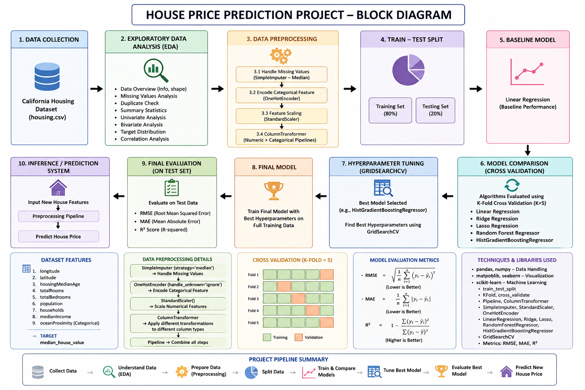
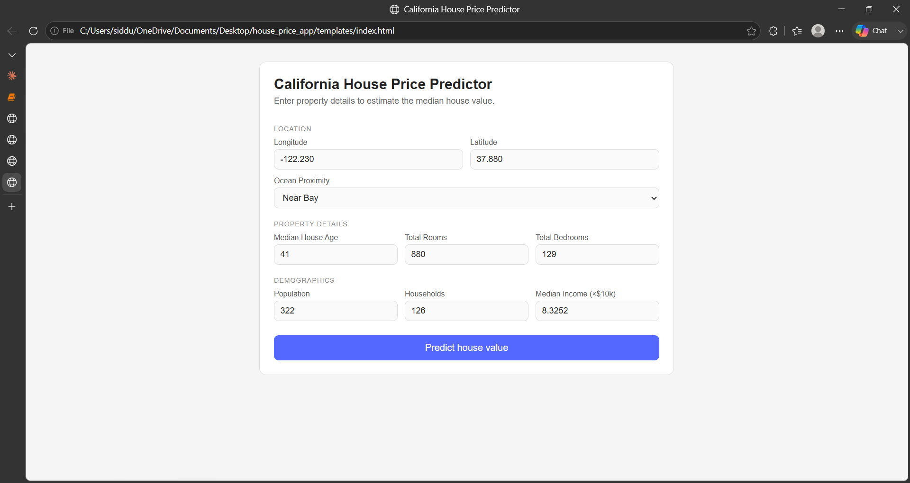
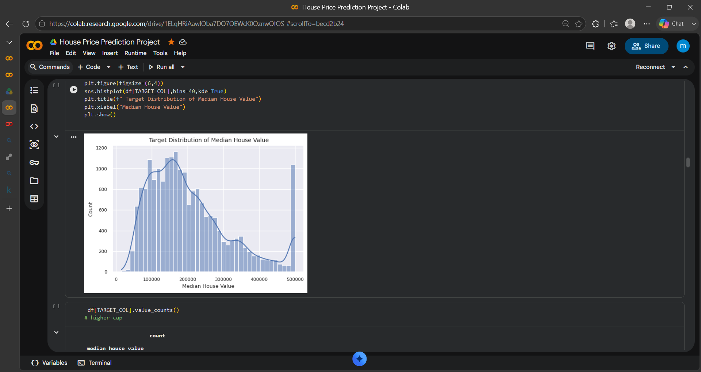
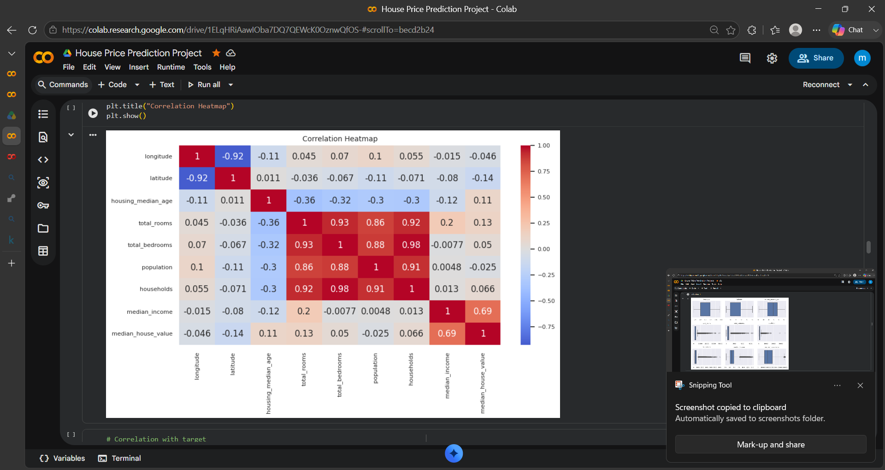
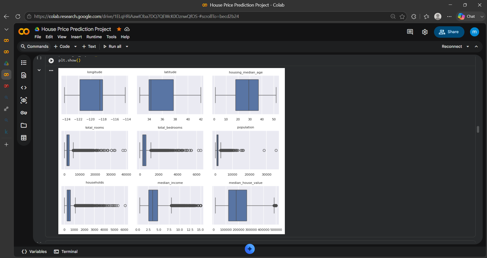
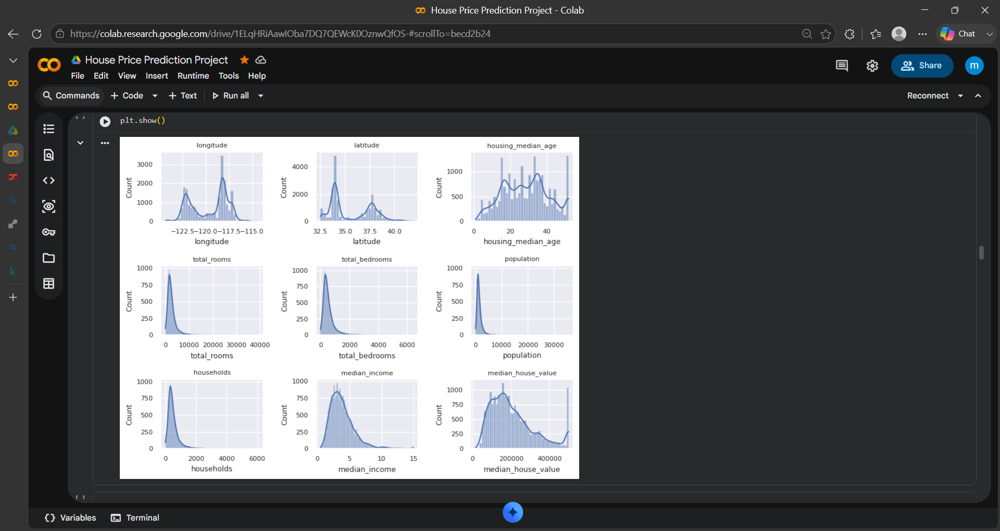
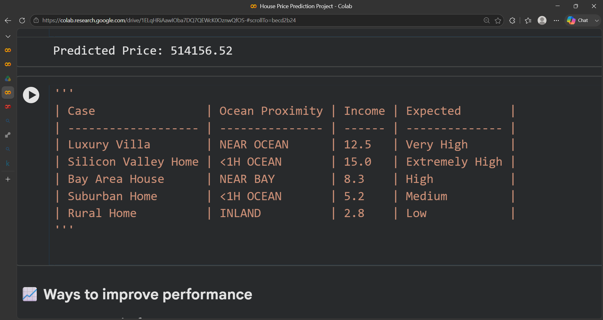
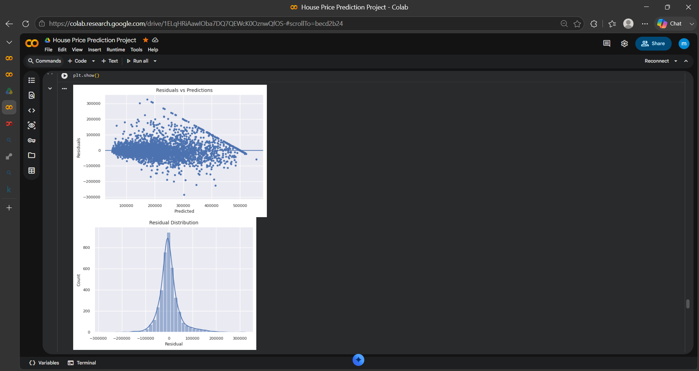
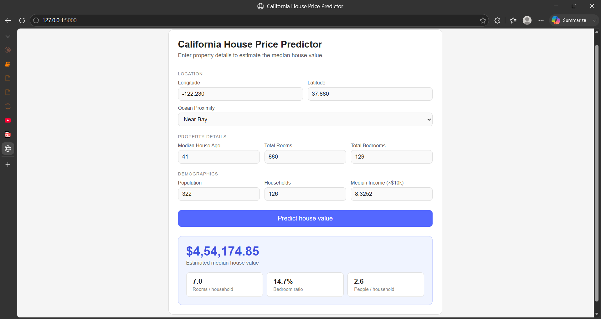
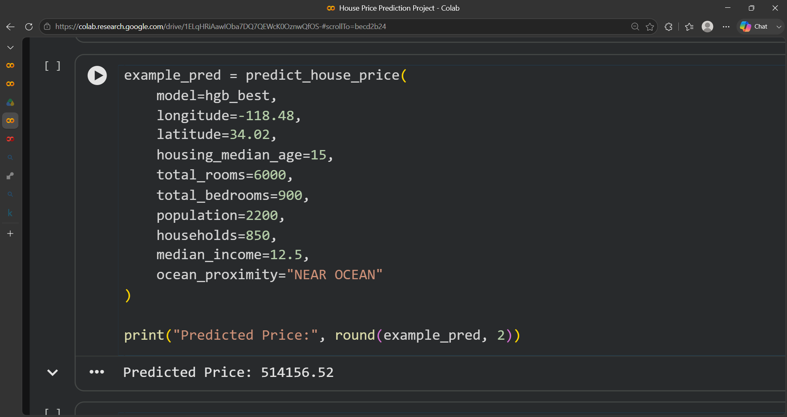

# 🏡 California House Price Prediction using Machine Learning

<p align="center">
  
</p>

<p align="center">
<b>An End-to-End Machine Learning Project for Predicting California House Prices using Data Analytics, Feature Engineering, and Advanced Regression Models.</b>
</p>

---

# 📌 Project Overview

The **California House Price Prediction** project is an end-to-end Machine Learning application that predicts residential property prices across California using housing, demographic, and geographical features.

The project follows the complete Data Science lifecycle—from data exploration and preprocessing to model development and evaluation. Multiple regression algorithms were compared, and the best-performing model was selected through cross-validation and hyperparameter tuning to provide accurate and reliable house price predictions.

This project demonstrates practical applications of Machine Learning in the real-estate domain while following industry-standard development practices.

---

# 🎯 Project Objectives

* Predict California house prices accurately using Machine Learning.
* Analyze housing data through Exploratory Data Analysis (EDA).
* Compare multiple regression algorithms.
* Optimize model performance using Cross Validation and GridSearchCV.
* Build a deployment-ready prediction pipeline.
* Develop a Flask-based web application for real-time predictions.

---

# 🚀 What This Project Does

The model predicts the estimated value of a house based on the following input features:

* 📍 Longitude
* 📍 Latitude
* 🏠 Housing Median Age
* 🚪 Total Rooms
* 🛏️ Total Bedrooms
* 👨‍👩‍👧 Population
* 🏘️ Households
* 💰 Median Income
* 🌊 Ocean Proximity

---

# 🔍 Project Highlights

* ✅ Exploratory Data Analysis (EDA)
* ✅ Data Cleaning & Missing Value Handling
* ✅ Feature Engineering
* ✅ Feature Scaling
* ✅ One-Hot Encoding
* ✅ Multiple Regression Model Comparison
* ✅ K-Fold Cross Validation
* ✅ Hyperparameter Tuning using GridSearchCV
* ✅ HistGradientBoostingRegressor Optimization
* ✅ End-to-End Machine Learning Pipeline
* ✅ Deployment-Ready Flask Integration

---

# 🛠️ Technologies Used

| Category                | Technologies        |
| ----------------------- | ------------------- |
| Programming Language    | Python              |
| Data Analysis           | Pandas, NumPy       |
| Visualization           | Matplotlib, Seaborn |
| Machine Learning        | Scikit-learn        |
| Development Environment | Jupyter Notebook    |
| Web Framework           | Flask               |
| Version Control         | Git & GitHub        |

---

# 📂 Project Structure

```text
California-House-Price-Prediction/
│
├── House_Price_Prediction.ipynb
├── housing.csv
├── README.md
├── California_Housing_Code_Walkthrough.pdf
├── block_diagram.png
├── website.png
├── result_in_collab.png
├── Exact_output.png
├── Heatmap.png
├── Boxplots.png
├── Count_Plots.png
├── House_Value_Distribution.png
├── Popular_input_features.png
├── Residual_plots.png
└── Screenshots/
```

---

# 📊 Machine Learning Workflow

```text
Housing Dataset
        │
        ▼
Data Cleaning
        │
        ▼
Exploratory Data Analysis
        │
        ▼
Feature Engineering
        │
        ▼
Data Preprocessing
        │
        ▼
Model Training
        │
        ▼
Cross Validation
        │
        ▼
Hyperparameter Tuning
        │
        ▼
Model Evaluation
        │
        ▼
House Price Prediction
```

---

# 📸 Project Screenshots

## 🏗️ Project Workflow

<p align="center">

</p>

---

## 🌐 Web Application

<p align="center">

</p>

---

## 📈 House Price Distribution

<p align="center">

</p>

---

## 🔥 Correlation Heatmap

<p align="center">

</p>

---

## 📦 Feature Distribution

<p align="center">

</p>

---

## 📊 Count Plots

<p align="center">

</p>

---

## 📈 Popular Input Features

<p align="center">

</p>

---

## 📉 Residual Plot

<p align="center">

</p>

---

## 💻 Prediction Output

<p align="center">

</p>

---

## 🧪 Jupyter Notebook Output

<p align="center">

</p>

---

# 📈 Model Performance

The final model was selected after evaluating multiple regression algorithms using cross-validation and hyperparameter tuning.

### Evaluation Metrics

* 📌 R² Score
* 📌 Mean Absolute Error (MAE)
* 📌 Root Mean Squared Error (RMSE)
* 📌 Cross Validation Score

> **Note:** Update this section with your actual evaluation metrics.

---

# 🌐 Web Application

A Flask-based web application is being developed to provide real-time house price predictions through a user-friendly interface.

Users can:

* Enter housing information
* Predict house prices instantly
* View prediction results
* Explore project analytics

---

# 🚀 How to Run

## Clone the Repository

```bash
git clone https://github.com/SANKEERTH2006-TECH/California-House-Price-Prediction.git
```

## Navigate to the Project Directory

```bash
cd California-House-Price-Prediction
```

## Install Dependencies

```bash
pip install -r requirements.txt
```

## Launch the Jupyter Notebook

```bash
jupyter notebook
```

Open:

```
House_Price_Prediction.ipynb
```

Run all cells to reproduce the project.

---

# 🎯 Future Enhancements

* Interactive Flask Web Application
* Responsive User Interface
* Real-Time Prediction Dashboard
* California Map-Based Visualization
* Model Deployment on Cloud Platforms
* Advanced Ensemble Learning Models
* REST API Integration
* Docker Support

---

# 📚 Learning Outcomes

This project helped strengthen my understanding of:

* Machine Learning
* Data Preprocessing
* Exploratory Data Analysis
* Regression Algorithms
* Feature Engineering
* Cross Validation
* Hyperparameter Tuning
* Model Evaluation
* Predictive Analytics
* Flask Web Development

---

# 📜 License

This project is licensed under the **MIT License**.

---

# 👨‍💻 Author

**Manda Sankeerth**

Electronics and Communication Engineering (ECE)

### Interests

* Machine Learning
* Data Science
* Artificial Intelligence
* VLSI Design
* Physical Design
* Embedded Systems

---

## ⭐ Support

If you found this project helpful, please consider giving it a **⭐ Star** on GitHub.

Your support motivates me to build more Machine Learning and Engineering projects while continuously improving my skills.
